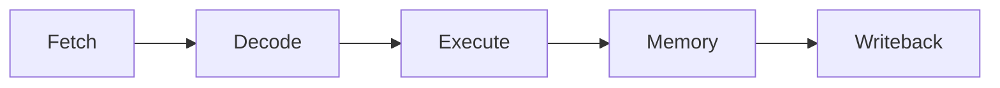

# Orion Core Specification

Orion is a `RV32IM` CPU with a simple five-stage, in-order pipeline and a Wishbone-facing system integration layer.

- ISA: `RV32IM`
- execution model: in-order
- pipeline depth: 5 stages
- external memory-facing integration: Wishbone

## Pipeline

Stage roles:

- `Fetch`: instruction address generation and instruction fetch
- `Decode`: instruction decode, register read, and control generation
- `Execute`: ALU operations, branch decision, and address calculation
- `Memory`: load/store access handling
- `Writeback`: register result commit

## Orion Memory Interface Protocol

This interface defines a simple in-order request/response protocol between a master (core) and a slave (cache or memory).

- Supports reads and writes.
- Allows multiple outstanding requests (pipelined mode)
- Guarantees in-order completion
- Uses a single shared response channel.

### Signals
> Directions shown below are from master's perspective

| Signal  | Direction | Description                                 |
| ------- | --------- | ------------------------------------------- |
| `valid` | M -> S    | Request valid                               |
| `ready` | S -> M    | Slave ready to accept request               |
| `addr`  | M -> S    | Address (word aligned)                      |
| `mask`  | M -> S    | Byte enable (1-bit per byte)                |
| `we`    | M -> S    | Write enable (1 = write, 0 = read)          |
| `wdata` | M -> S    | Write data (valid only for writes)          |
| `resp`  | S -> M    | Request completion                          |
| `err`   | S -> M    | Slave error                                 |
| `rdata` | S -> M    | Read data (valid only for successful reads) |

### Request Semantics
- Requests are sampled on the rising clock edge.
- A request is accepted on every cycle when `ready=1 && valid=1` (handshake).
- The slave may apply backpressure by setting `ready=0`.
- Each handshake cycle triggers an independent transaction (back-to-back handshakes possible).
- While a request is pending (`valid=1 && ready=0`), master must hold `addr`, `mask`, `we`, `wdata` stable till handshake happens. 
- The master may issue:
    - single requests (pulse valid)
    - or multiple back-to-back requests (keep `valid=1`)

### Response Semantics
- Each accepted request produces exactly one response (indicated by `resp=1` for one cycle).
- Responses are returned in the same order as requests.
- The `err` signal qualifies the response, `err=0` implies successful completion, `err=1` implies failed completion. 
- For read requests (`we=0`), `rdata` is valid only when `resp=1 && err=0`.

### Example Waveforms

#### Single Transactions
1. **read (addr=A0):** response arrives with D0 next cycle
2. **read (addr=A1):** response arrives with D1 after 2 cycles
3. **write (addr=A2, wdata=D2):** response arrives next cycle

#### Pipelined Transactions
1. **read (addr=A0):** response arrives with D0 next cycle
2. **write (addr=A1, wdata=D1):** response arrives after 4 cycles
3. **read (addr=A2):** response arrives with D2 after 4 cycles
4. **write (addr=A3, wdata=D3):** response arrives after 3 cycles (failed)

## Reference Specs
- [`docs/specs/RISCV_Unprivileged_ISA.pdf`](specs/RISCV_Unprivileged_ISA.pdf)
- [`docs/specs/RISCV_Privileged_ISA.pdf`](specs/RISCV_Privileged_ISA.pdf)
- [`docs/specs/wbspec_b4.pdf`](specs/wbspec_b4.pdf)
