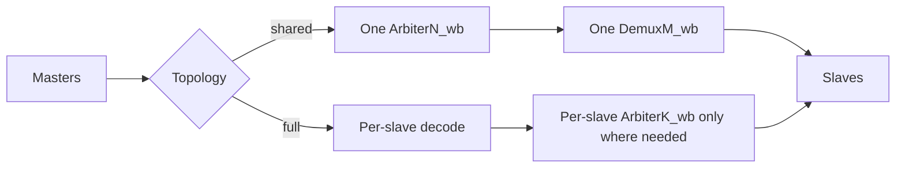
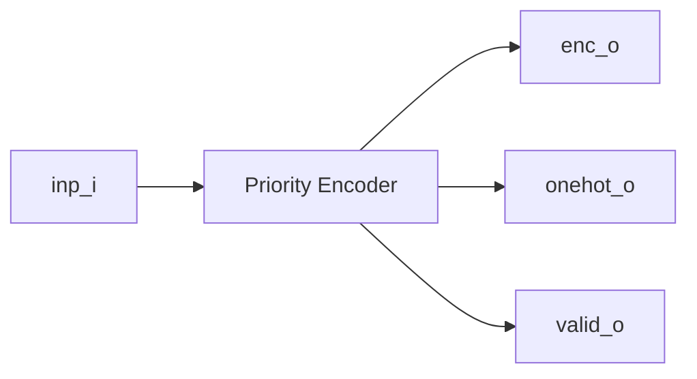
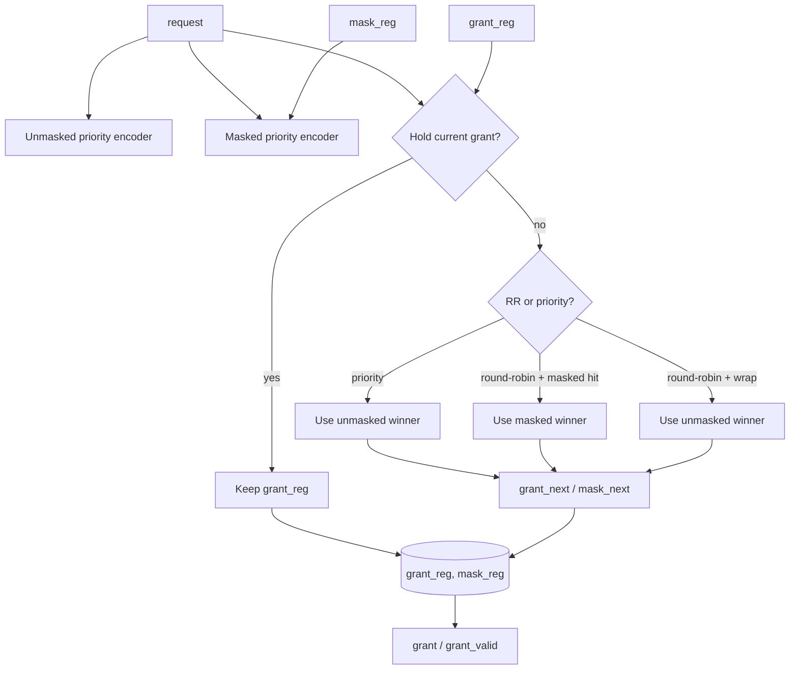
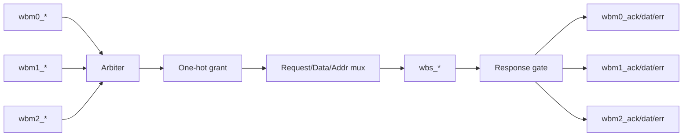
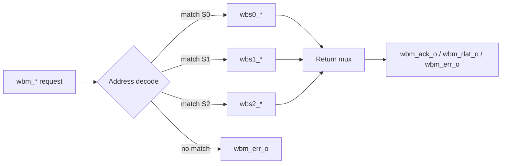
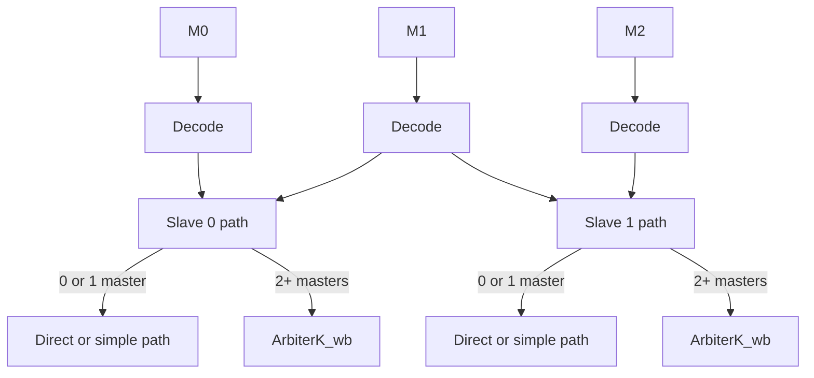
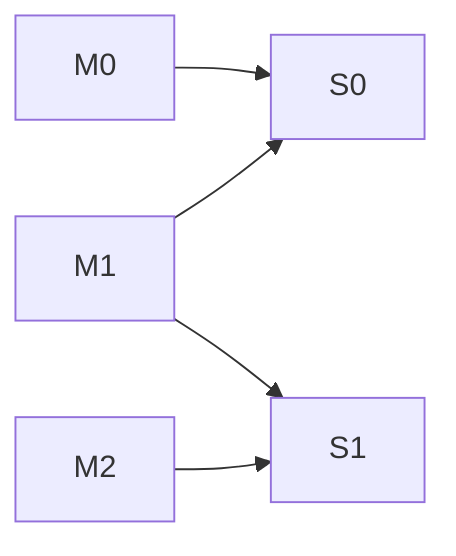
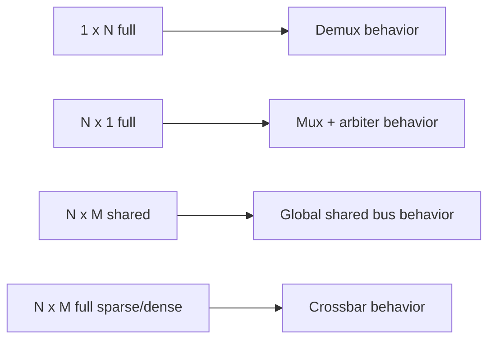

# Wishbone Crossbar Generator

`gen_wbxbar2.py` generates small Wishbone building blocks and composes them into either a simple shared bus or a sparse/full crossbar.

It can generate:
- `demux`: `1 -> N` address decoder/router
- `arb`: generic request arbiter
- `mux`: `N -> 1` Wishbone arbited mux
- `xbar`: `N x M` interconnect

It can also append a randomized SystemVerilog testbench for `xbar`, which is enough to exercise:
- pure demux-like cases: `1 x N`
- pure mux-like cases: `N x 1`
- shared bus topology
- sparse or dense full crossbars

## Big Picture



## Generated Blocks

### 1. Priority Encoder

Used internally by the arbiter.



### 2. Arbiter

Generic request arbiter, not Wishbone-specific.

Parameters:
- `ARB_TYPE_ROUND_ROBIN`: `0=priority`, `1=round-robin`
- `ARB_LSB_HIGH_PRIORITY`: fixed-priority direction

Behavior:
- request is a bit vector
- grant is one-hot
- current grant is held while that requester still asserts `request`
- round-robin uses a rotating mask



### 3. Wishbone Mux

Arbitrates several masters onto one shared slave port.



Notes:
- arbitration is based on `cyc`
- only the granted master sees `ack/err`
- all masters see `wbs_dat_i`, but only the granted master sees the handshake

### 4. Wishbone Demux

Routes one master port to one selected slave using address decode.



Decode rule:

```text
(addr & MASK) == (BASE & MASK)
```

## Crossbar Topologies

### Shared

Simple structure, one transaction at a time across the whole fabric.


Properties:
- simplest generated fabric
- global contention point
- good for smoke tests and low-area interconnect

### Full

Per-slave arbitration with connectivity control.



Properties:
- multiple transactions can happen at once if they target different slaves
- sparse connectivity is supported
- only contested slave ports get arbiters

## Connectivity Matrix

`full` xbar uses `-c/--connectivity`.

Format:

```text
master:slave,slave;master:slave
```

Examples:

```bash
-c '*:*'
-c '0:0;1:0,1;2:1'
-c '0:2,3;1:0'
```

Meaning of:
- `*:*`: every master can reach every slave
- `0:0;1:0,1;2:1`: `M0 -> S0`, `M1 -> S0,S1`, `M2 -> S1`

Example matrix:



## CLI Usage

### Generate a demux

```bash
python3 crossbar-test/gen_wbxbar2.py demux -n 4 -N Demux4_wb -o demux4.v
```

### Generate a generic arbiter

```bash
python3 crossbar-test/gen_wbxbar2.py arb -n 4 -N Arbiter4 -p rr --priority-lsb-high -o arb4.v
```

### Generate a mux

```bash
python3 crossbar-test/gen_wbxbar2.py mux -m 4 -N Arbiter4_wb -p priority -o mux4.v
```

### Generate a shared crossbar

```bash
python3 crossbar-test/gen_wbxbar2.py xbar -t shared -m 3 -s 2 -N Shared3x2 -o shared3x2.v
```

### Generate a sparse full crossbar

```bash
python3 crossbar-test/gen_wbxbar2.py xbar \
  -t full \
  -m 3 \
  -s 2 \
  -c '0:0;1:0,1;2:1' \
  -N Full3x2 \
  -o full3x2.v
```

## Generate a Randomized TB

`--tb` is supported on `xbar`.

```bash
python3 crossbar-test/gen_wbxbar2.py xbar \
  -t full \
  -m 3 \
  -s 2 \
  -c '0:0;1:0,1;2:1' \
  -N Full3x2 \
  --tb \
  --tb-cycles 300 \
  -o full3x2_tb.sv
```

The generated TB includes:
- directed sanity checks
- randomized master state machines
- randomized slave response state machines
- simultaneous requests to create contention
- summary stats at the end

Stats printed include:
- issued/completed/errors
- contention cycles
- per-master latency and wait cycles
- per-slave utilization

## Compile and Run

### One-off

```bash
iverilog -g2012 -o full3x2_tb.out full3x2_tb.sv
vvp full3x2_tb.out
```

### Reproducible scripted runs

Artifacts are kept under [`crossbar-test/test/generated`](/home/saursin/work/orion/crossbar-test/test/generated).

Run the built-in campaign:

```bash
cd crossbar-test/test
bash ./run_xbar_tests.sh
```

Run one generated xbar TB:

```bash
cd crossbar-test/test
bash ./run_generated_tb.sh xbar -t full -m 4 -s 1 -N MuxLike4x1 --tb-cycles 120
```

## Recommended Verification Shapes

Use `xbar --tb` to cover all subcomponents through degenerate cases:



Suggested set:
- `1 x N full`: verifies demux path
- `N x 1 full`: verifies mux + arbiter path
- `N x M shared`: verifies shared topology
- sparse `N x M full`: verifies connectivity matrix behavior

## File Map

- [`gen_wbxbar2.py`](/home/saursin/work/orion/crossbar-test/gen_wbxbar2.py): generator
- [`test/run_xbar_tests.sh`](/home/saursin/work/orion/crossbar-test/test/run_xbar_tests.sh): scripted regression
- [`test/run_generated_tb.sh`](/home/saursin/work/orion/crossbar-test/test/run_generated_tb.sh): run one generated case
